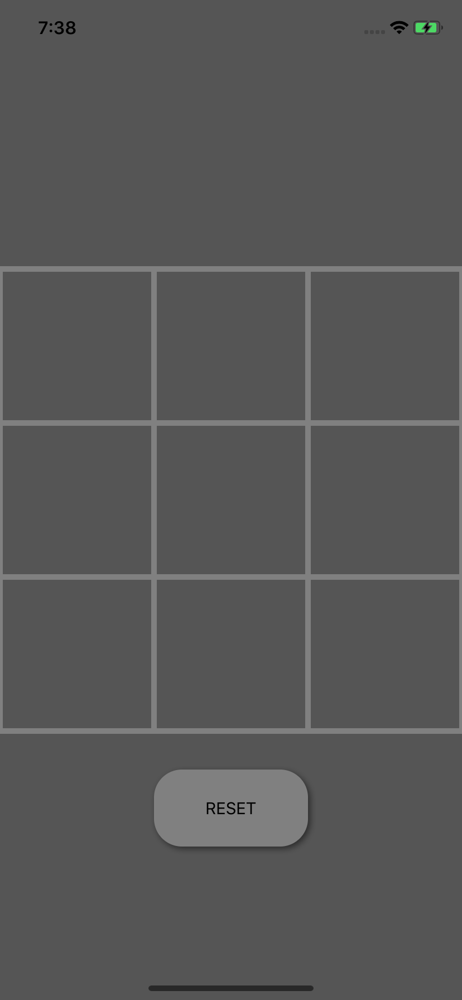
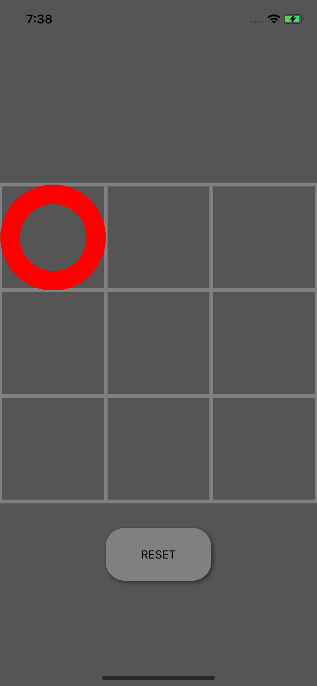
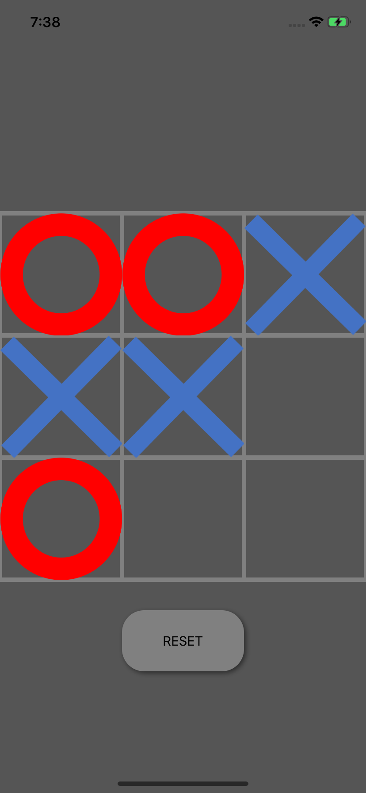

# TicTacToe
This is a repository for my app "TicTacToe" or "MaruBatsuGame".

This is an app of TicTacToe.
It is called Maru-Batsu-Game in Japan.

This app serves basic game of it.
Player 1 vs. Player 2.
Player win when he make the line composed of 3 elements of him.

